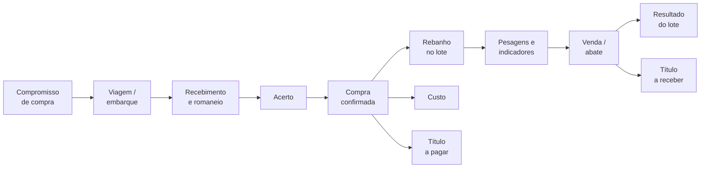

<div align="center">


# Rebanho360

**Gestão pecuária para fazenda a pasto, com a compra de gado integrada.**<br>
Do cadastro e da negociação à entrada no rebanho, ao custo, ao financeiro e ao resultado por lote.


[Visão geral](docs/00-visao-geral.md) ·
[Documentação](docs/README.md) ·
[Roadmap](docs/roadmap/README.md) ·
[Pendências de negócio](docs/regras-negocio/99-pendencias.md)

</div>

---

## O que é

O Rebanho360 substitui uma planilha Excel de 17 abas que controla uma operação de **várias fazendas, milhares de cabeças e milhões de reais em compra e custo por safra**. Ele cobre o ciclo inteiro da operação:



> **Não é um SaaS.** Sem multi-tenant, planos, cobrança ou marketplace. É um sistema interno, feito para uma operação específica, e por isso pode ser simples onde um produto genérico precisaria ser flexível.
>
> **Registra, não deduz.** Onde preço, alíquota, comissão, quebra, custo ou condição de pagamento variam de uma operação para outra, o sistema prefere **campos editáveis** a presumir um valor: ele serve a registrar, controlar e rastrear. A automação fica para reaproveitar o que já foi lançado, gerar documentos e títulos a partir de lançamentos aprovados, consolidar centros de custo e alimentar relatórios.

## Por que existe

A planilha funcionou até chegar ao limite:

| Na planilha | No sistema |
|---|---|
| O consolidado de cabeças fecha em **−140**: transferências que saíram e nunca entraram | O saldo é a soma de um razão de movimentações. Transferência é sempre duas linhas que somam zero, na mesma transação. Representar −140 é **impossível** |
| `#DIV/0!` por toda parte, quando falta dado | Divisor zero devolve `None`, e a tela mostra "—". Falta de dado é estado normal |
| Peso médio, rendimento e valor por arroba **digitados**, divergindo da fórmula ao lado | Todo derivado é calculado, nunca gravado, em **um** serviço consumido por tela, relatório e dashboard |
| Cada fazenda é uma aba copiada à mão | Uma estrutura, filtrada por fazenda |
| Uma pessoa por vez | Campo lança no celular enquanto o escritório fecha o custo |

## Princípios inegociáveis

O sistema é construído em torno de seis regras, cada uma com teste e documento próprio (resumo operacional em [docs/README.md](docs/README.md)):

1. **Saldo do rebanho é derivado, nunca campo.** `HerdMovement` gera `HerdLedgerEntry`; saldo é `SUM`. ([regra](docs/regras-negocio/01-rebanho-movimentacoes.md) · [ADR 0002](docs/arquitetura/adr/0002-rebanho-como-razao-de-movimentacoes.md))
2. **`Decimal` sempre, `float` nunca**, com `ROUND_HALF_UP` só no fim da cadeia. ([ADR 0005](docs/arquitetura/adr/0005-decimal-e-arredondamento.md))
3. **Divisor zero devolve `None`**, nunca `0` nem erro.
4. **Escopo por fazenda em toda consulta.** O papel define *o quê*; o acesso à fazenda define *onde*. Fora do escopo, `404` (não `403`, que confirmaria que existe). ([ADR 0003](docs/arquitetura/adr/0003-escopo-por-fazenda-desde-a-fase-0.md))
5. **Tudo é editável e excluível, e tudo fica auditado.** Desfazer uma ação desfaz todos os efeitos dela, com análise de impacto antes e motivo obrigatório. A auditoria é imutável, **inclusive para o administrador**. ([regra](docs/regras-negocio/06-edicao-exclusao-e-auditoria.md) · [ADR 0006](docs/arquitetura/adr/0006-tudo-editavel-com-auditoria-imutavel.md))
6. **Derivado é calculado, nunca gravado.** ([indicadores](docs/regras-negocio/05-indicadores-e-calculos.md))

## O que o sistema faz

O menu segue três blocos, mais um de administração.

| Bloco | O que contém |
|---|---|
| **Entrada** | Empresas, unidades, safras, fazendas, pastos, **infraestrutura e máquinas** · parceiros multi-papel e contas bancárias · categorias, raças e lotes (pasto ou confinamento) · classes de carcaça, tributos, regras de comissão e **condições de pagamento** · centros de custo |
| **Movimentações** | Compras e compromissos (**vários compradores**, cada um com a sua comissão) · viagens (ADF, motorista, veículo) e recebimento com romaneio e quebra de viagem informada · acerto com distribuição entre itens **informada pelo usuário**, trava e reabertura · rebanho (saldo inicial, compra, nascimento, transferência, evolução, abate, venda, morte com causa, ajuste de inventário) · **reprodução** · pesagens · custos com rateio sem centavo perdido · vendas e abates, com rendimento de carcaça informado pelo frigorífico · financeiro: títulos (frete por viagem, comissão por comprador, tributos por linha, parcelas), programação, aprovação e baixa · encerramento manual da operação |
| **Relatórios e análise** | Mais de 25 relatórios com exportação CSV, XLSX e PDF, entre eles **curva ABC de custos, inventário valorizado, TIR da safra, mortalidade por causa, confinamento e indicadores reprodutivos** · contrato de compra, programação de embarque e conferência do acerto em PDF · painel de pendências · dashboards · fluxo de caixa projetado e mapa financeiro |
| **Sistema** | Importação conferida de planilha (staging → validação → prévia → confirmação) · exportação de dados em segundo plano · auditoria · usuários e pedido de acesso com aprovação · conta, senha e segundo fator |

Toda operação do ciclo de compra carrega **um número só** (`OP-000123`, e `/V1`, `/R1`, `/AC1`, `/I1` nas etapas).

**Interface pensada para o campo.** Mobile first de verdade: tabela vira cartão no celular, botões de 44 px, rascunho salvo no aparelho, contexto Empresa · Safra · Fazenda sempre no topo. Nada carregado de CDN, porque o campo trabalha com sinal ruim. Design system próprio em [docs/ux/02-design-system.md](docs/ux/02-design-system.md).

**Segurança.** Argon2, limite de tentativas no login, e-mail obrigatório para todo usuário (entra-se por usuário ou e-mail), **2FA (TOTP) opcional** — e obrigatório para todos com uma variável de ambiente —, quem aprova pagamento não dá a baixa (havendo outro executor), anexos servidos por view autenticada. Ver [docs/seguranca](docs/seguranca/01-seguranca.md).

## Estado do projeto

**Código das Fases 0 a 5 pronto, mais parte da Fase 6** (exportação de dados, dashboard analítico, gestão a pasto resumida e indicadores de consultoria). **Faltam as tarefas de deploy**, que dependem de um servidor real; os scripts e o `docker-compose.prod.yml` já existem.

| Fase | Entrega | Estado |
|---|---|---|
| [0](docs/roadmap/fase-0-fundacao.md) | Fundação: login, escopo, auditoria, health check, backup | Código pronto · deploy pendente |
| [1](docs/roadmap/fase-1-cadastros-e-rebanho.md) | Cadastros e rebanho como razão | Código pronto · deploy pendente |
| [2](docs/roadmap/fase-2-custos-compras-importacao.md) | Custos, compras e importação conferida | Código pronto · deploy pendente |
| [3](docs/roadmap/fase-3-vendas-e-indicadores.md) | Vendas, abates e indicadores | Código pronto · deploy pendente |
| [4](docs/roadmap/fase-4-financeiro.md) | Financeiro: títulos, baixas, 2FA | Código pronto · deploy pendente |
| [5](docs/roadmap/fase-5-ciclo-frigorifico.md) | Ciclo de compra: compromisso → viagem → recebimento → acerto | Código pronto · deploy pendente |
| [6](docs/roadmap/fase-6-avancado.md) | Avançado: exportação, dashboard, reprodução, infraestrutura e máquinas, indicadores | Parcial |

O que ainda falta contra o documento funcional está na [matriz de alinhamento](docs/fluxos/04-alinhamento-ao-doc-funcional.md); as decisões de negócio mais recentes, em [decisões de negócio recentes](docs/regras-negocio/12-decisoes-do-cliente-2026-10-03.md).

### Perguntas de negócio em aberto

O maior risco do projeto não é técnico, é modelar o negócio errado. Restam **19 pendências** em [99-pendencias](docs/regras-negocio/99-pendencias.md), cada uma com o padrão **mais reversível** já implementado e o código isolado para ajuste; as já respondidas ou dispensadas ficam em [99-pendencias-resolvidas](docs/regras-negocio/99-pendencias-resolvidas.md). As respostas recentes são **provisórias**: serão validadas com os usuários da operação, com o sistema na tela ([roteiro](docs/regras-negocio/14-roteiro-de-validacao-com-os-usuarios.md)). Duas coisas pesam antes de usar com dado real:

- **Tributos:** nada tributário é calculado; Funrural, Fundepec, GTA, ICMS e demais são **valores digitados** (com alíquota, base e favorecido só como registro) até um contador definir as regras ([#21](docs/regras-negocio/99-pendencias.md#21--efeito-padrão-de-cada-natureza-de-tributo-contador-fase-5)).
- **Mais de uma empresa:** a barra do topo ainda não troca de empresa ([#47](docs/regras-negocio/99-pendencias.md#47--mais-de-uma-empresa-troca-de-empresa-no-topo-e-escopo-fase-0)); hoje só a primeira é operável.

## Stack

| Camada | Tecnologia |
|---|---|
| Linguagem e framework | Python 3.12 · Django 5.0 |
| Banco | PostgreSQL 16 (nunca SQLite) |
| Interface | Django Templates · HTMX · Alpine.js · Tailwind (CLI standalone, sem Node) |
| Tarefas em segundo plano | Celery + Redis |
| PDF e planilhas | WeasyPrint · openpyxl |
| Infra | Docker Compose em VPS Ubuntu compartilhado, Nginx do host |

Sem React/Vue. Fontes IBM Plex locais e ícones Lucide em sprite SVG. Monólito modular: [ADR 0001](docs/arquitetura/adr/0001-monolito-modular-django.md).

## Começando

**Requisitos:** Docker com Compose v2 e `python3` (só para gerar a chave do `.env`). A primeira execução baixa o Tailwind standalone, então precisa de rede.

```bash
./deploy/local.sh
```

Um comando, de qualquer pasta. Cria o `.env` se não existir (com uma `DJANGO_SECRET_KEY` gerada), sobe os containers, migra, carrega os dados de demonstração, compila o CSS e espera o `/ready/`. Pode ser repetido a qualquer momento.

<details>
<summary>O mesmo passo a passo, à mão</summary>

```bash
cp .env.example .env        # preencha DJANGO_SECRET_KEY e as senhas
docker compose up --build -d
docker compose exec web python manage.py migrate
docker compose exec web python manage.py seed_demo
docker compose exec web sh bin/build_css.sh   # gera backend/static/css/output.css
```

`output.css` é **gerado e não é versionado**: sem compilá-lo, a tela abre sem estilo. Recompile depois de mexer em `input.css`, em `tailwind.config.js` ou ao usar classes novas nos templates.

</details>

Acesse **http://127.0.0.1:8000/contas/entrar/**. Usuários de demonstração (senha `demo12345` para todos, **apenas em desenvolvimento**):

| Usuário | Papel | Observação |
|---|---|---|
| `admin@teste` | `ADMIN` | |
| `gestor@teste` | `GESTOR` | Enxerga tudo |
| `escritorio@teste` | `ESCRITORIO` | Custos, compras, vendas |
| `campo@teste` | `CAMPO` | Só a fazenda Baixão — para testar o escopo |
| `financeiro@teste` | `FINANCEIRO` | |
| `consulta@teste` | `CONSULTA` | Só leitura |

### Testes

O Postgres não é exposto ao host, então os testes rodam dentro do contêiner:

```bash
docker compose up -d db redis
docker compose run --rm --no-deps -T web python -m pytest -p no:cacheprovider -q
```

São **mais de 1.700 testes**, em cerca de 20 minutos contra Postgres real. Os testes de importação que usam uma planilha real de exemplo **pulam** quando o arquivo não está no clone (ele não é versionado: contém dados operacionais). A suíte não persegue cobertura: cobre o que não pode falhar. **Cálculo** (arredondamento, divisor zero, transferência que soma zero, rateio sem centavo perdido, TIR), **integridade** (saldo nunca negativo, confirmação concorrente, clique duplo na baixa) e **segurança** (`403` sem permissão, `404` fora do escopo, POST sem CSRF, quem ativou o segundo fator não entra sem ele).

Qualidade de código: `ruff check apps config` e `black --check apps config`, no mesmo contêiner.

## Estrutura do repositório

```
backend/            Django
├── apps/           um app por domínio: core, accounts, organizations, properties,
│                   partners, livestock, herd, reproduction, infrastructure, costs,
│                   commercial, procurement, purchases, sales, finance, imports,
│                   exports, reports, dashboards, documents, audit
├── config/         settings (dev/prod), URLs, Celery
├── templates/      base, partials e telas
├── static/         CSS (design system), fontes, ícones, HTMX e Alpine locais
└── requirements/   base, dev e prod
docker/             Dockerfile (estágios dev e prod)
deploy/             local, deploy, backup, rollback, healthcheck, exemplo de Nginx
docs/               documentação completa (comece por docs/README.md)
```

Dentro de cada app: `models / services / selectors / forms / permissions / tasks / tests`. **A view não escreve no banco e o template não calcula.**

## Documentação

| Se você quer… | Leia |
|---|---|
| Entender o projeto | [docs/00-visao-geral.md](docs/00-visao-geral.md) |
| Entender a arquitetura | [docs/arquitetura/01-arquitetura.md](docs/arquitetura/01-arquitetura.md) · [ADRs](docs/arquitetura/adr/) |
| Entender a regra central | [docs/regras-negocio/01-rebanho-movimentacoes.md](docs/regras-negocio/01-rebanho-movimentacoes.md) |
| Entender o ciclo de compra | [docs/regras-negocio/08-ciclo-de-compra.md](docs/regras-negocio/08-ciclo-de-compra.md) |
| Entender títulos, baixas e aprovação | [docs/regras-negocio/07-financeiro.md](docs/regras-negocio/07-financeiro.md) |
| Mexer na interface | [Design system](docs/ux/02-design-system.md) · [navegação e UI](docs/ux/01-navegacao-e-ui.md) |
| Subir em produção, fazer backup e rollback | [deploy/](deploy/) · [docs/arquitetura/02-infra-e-deploy.md](docs/arquitetura/02-infra-e-deploy.md) |
| Segurança | [docs/seguranca/01-seguranca.md](docs/seguranca/01-seguranca.md) |
| Saber o que construir agora | [docs/roadmap/README.md](docs/roadmap/README.md) |
| Saber o que ainda está em dúvida | [docs/regras-negocio/99-pendencias.md](docs/regras-negocio/99-pendencias.md) |
| Entender a gestão a pasto e os indicadores | [docs/regras-negocio/13-gestao-a-pasto-e-indicadores-do-consultor.md](docs/regras-negocio/13-gestao-a-pasto-e-indicadores-do-consultor.md) |

## Colocando no ar

Produção usa `docker-compose.prod.yml` (imagem fixa, sem bind mount; só o `web` publica porta, e só em `127.0.0.1`) atrás do Nginx do host. Os scripts em [`deploy/`](deploy/) fazem backup antes de cada deploy, publicam os estáticos, conferem a saúde e permitem rollback.

**Primeiro deploy do zero, passo a passo (VPS, `.env`, Nginx, HTTPS, primeiro acesso, backup): [`deploy/GUIA-DEPLOY-PRODUCAO.md`](deploy/GUIA-DEPLOY-PRODUCAO.md).**

Pontos de atenção do primeiro deploy:

- **Reconstruir a imagem**: `pydyf` está fixada em `0.10.0` (versões mais novas quebram o PDF do WeasyPrint) e a Fase 4 trouxe a `segno`, do QR do 2FA.
- **2FA é opcional** por padrão (`TWO_FACTOR_OBRIGATORIO=True` o torna obrigatório para todos). Rode `manage.py conferir_segundo_fator` para conferir o relógio do servidor (os códigos dependem dele) e ver quem já usa.
- **Configurar o SMTP**, usado nos convites e nos avisos de pedido de acesso (variáveis `EMAIL_*` no `.env.example`): como o e-mail é obrigatório, sem ele ninguém recebe o link de senha.
- **`.env` com `chmod 600`**, `DJANGO_DEBUG=False` e `DJANGO_HSTS_SECONDS=0` até confirmar que o HTTPS funciona.
- Nunca usar os usuários de demonstração: o `seed_demo` é só para desenvolvimento.

## Contribuindo e licença

- **Nunca versione** o `.env`, senhas, chaves, dados bancários, planilhas ou relatórios com dados reais da operação. O `.gitignore` já exclui o `.env` e `docs/fontes/`; confira o `git status` antes de cada commit.
- Mudou classe ou CSS? Recompile com `docker compose exec web sh bin/build_css.sh`.
- Vai mexer em regra de negócio? Leia antes [docs/regras-negocio/99-pendencias.md](docs/regras-negocio/99-pendencias.md): se a regra falta, registre a pergunta lá e implemente a alternativa **mais reversível**, em vez de inventar em silêncio.
- **Licença:** ainda não definida. Sem um arquivo `LICENSE`, todos os direitos ficam reservados ao autor.
