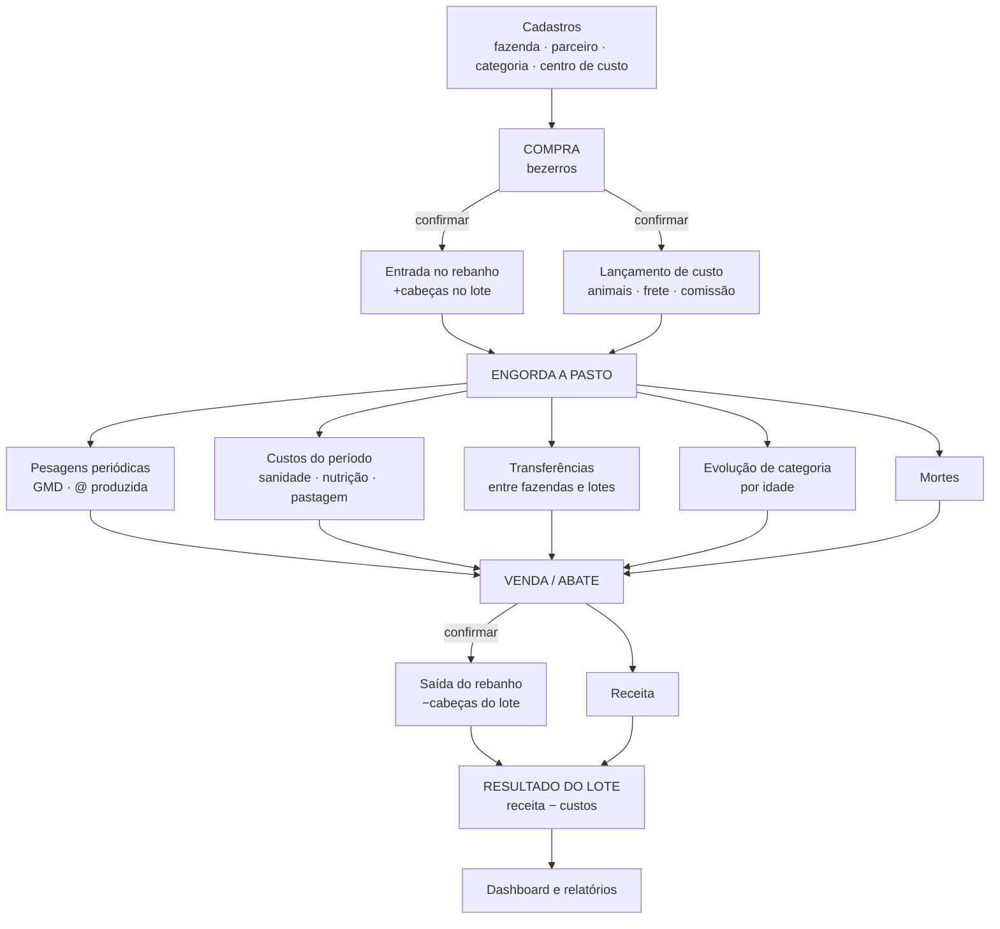

# Fluxo da fazenda a pasto

O ciclo real da operação: comprar bezerro, engordar a pasto, abater.

## Visão geral



## Onde estava o retrabalho

Na planilha, uma compra de bezerros é digitada **duas vezes**: na aba `COMPRA DE GADO` e de novo na aba da fazenda como movimentação. Nada liga as duas.

No sistema, confirmar a compra gera o movimento e os custos na mesma transação. Um fato, um lançamento.

Mesma coisa na saída: hoje o abate é digitado na aba `VENDAS` e a baixa do rebanho é digitada na aba da fazenda. Confirmar a venda faz as duas.

## As etapas

### 1. Cadastros (uma vez)

Empresa → Unidade → **Safra** → Fazendas → Áreas/Pastos · Parceiros · Categorias · Centros de custo.

Safra é o eixo de tudo. Todo lançamento cai numa safra, derivada da data.

### 2. Compra

Estados: `RASCUNHO → CONFIRMADA → EXCLUÍDA`, editável e restaurável. Detalhes em [regras-negocio/03](../regras-negocio/03-compra-de-gado.md).

Confirmar, em uma transação: cria o lote (ou usa existente) · gera movimento `COMPRA` (+cabeças) · gera `CostEntry` para animais, frete, comissão e impostos · registra na linha do tempo.

### 3. Engorda

O dia a dia. Quatro tipos de lançamento:

**Pesagem** — não muda saldo, alimenta GMD.
**Custo** — sanidade, nutrição, pastagem, funcionário. Direto ao lote quando dá; rateado quando não.
**Transferência** — entre fazendas ou lotes. **Movimento de 2 linhas**, soma zero.
**Evolução** — mudança de categoria por idade. Também 2 linhas, soma zero.
**Morte** — 1 linha negativa, motivo obrigatório.

### 4. Venda / Abate

Estados: `RASCUNHO → CONFIRMADA → EXCLUÍDA`, editável e restaurável. Detalhes em [regras-negocio/04](../regras-negocio/04-venda-e-abate.md).

Confirmar, em uma transação: verifica saldo **sob trava** · gera movimento `ABATE`/`VENDA` (−cabeças) · registra receita · sugere pesagem de saída.

### 5. Resultado

Com o lote a saldo zero, ele encerra e o resultado congela:

```
receita          R$ 401.502,68
− aquisição      R$ 225.000,00
− custos diretos R$  18.400,00
− rateados       R$  42.100,00
────────────────────────────────
= resultado      R$ 116.002,68
  margem/@       R$      77,85
```

## A tela central: o lote

Assim como uma compra é o centro do sistema do frigorífico, **o lote é o centro daqui**. É a unidade de custeio e de resultado.

```
LOTE LT-SFR-004                            Safra 2025/2026 · ABERTO

Fazenda    São Francisco        Entrada    18/09/2025
Origem     Compra CP-2025/26-0003          Categoria  Machos Desm. até 12m

┌─ POSIÇÃO ─────────┬─ DESEMPENHO ────────┬─ FINANCEIRO ──────────┐
│ Cabeças      133  │ Peso médio   208 kg │ Aquisição  R$ 268.000 │
│ Entradas     133  │ GMD      0,74 kg/d  │ Custos     R$  41.200 │
│ Saídas         0  │ @ produzida    —    │ Custo/cab  R$   2.325 │
│ Mortes         0  │ Dias          377   │ Custo/@         —     │
└───────────────────┴─────────────────────┴───────────────────────┘

⚠ Sem pesagem desde 12/11/2025 — GMD pode estar desatualizado
⚠ @ produzida indisponível: falta peso de carcaça

[ Movimentações ] [ Pesagens ] [ Custos ] [ Linha do tempo ]

  18/09/2025  Lote criado pela compra CP-2025/26-0003    Warley
  18/09/2025  Entrada de 133 cabeças                     Warley
  12/11/2025  Pesagem de conferência · 133 cb · 208 kg   José
```

Os avisos são o ponto. "@ produzida indisponível: falta peso de carcaça" é melhor que um zero — é o que a planilha nunca fez, e é o que transforma o sistema em ferramenta de controle em vez de cadastro.

## Pendências do rebanho na tela

Painel de conferência humana, alimentado por regras:

- Transferência de saída sem entrada correspondente *(o −140)*
- Lote sem pesagem há mais de 90 dias
- Custo sem centro de custo
- Venda sem peso de carcaça
- Lote com saldo zero ainda aberto
- Mortalidade acima do normal no período
- Rendimento de carcaça fora de 40%–65%

O sistema existe para **detectar problema antes do fechamento**.
