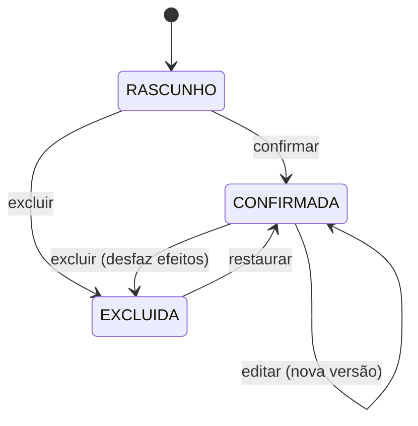
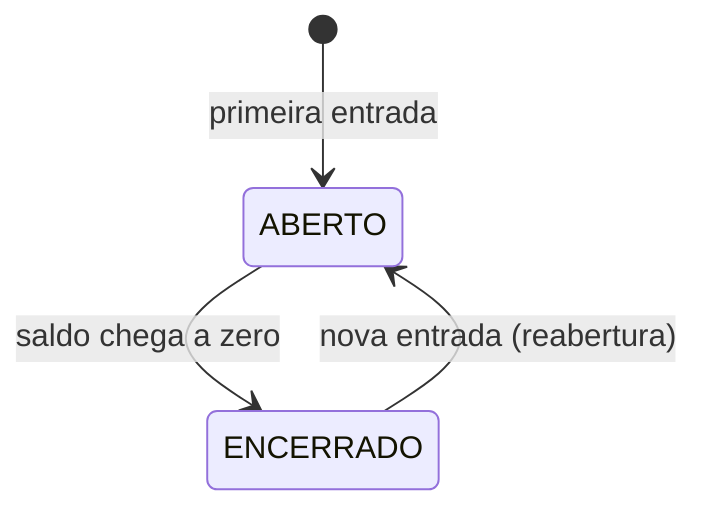
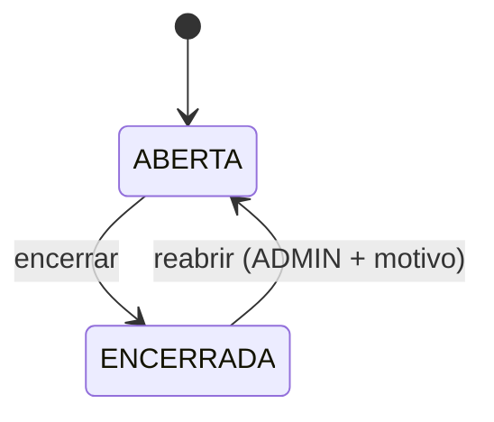
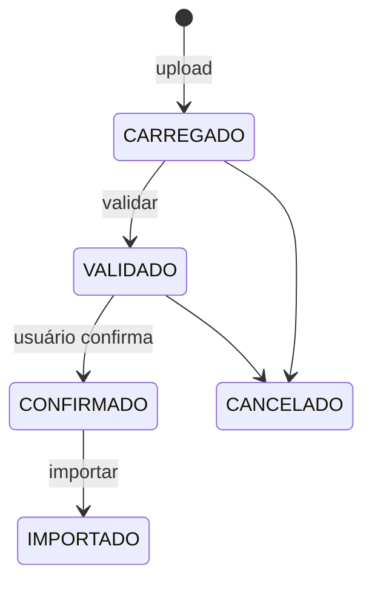
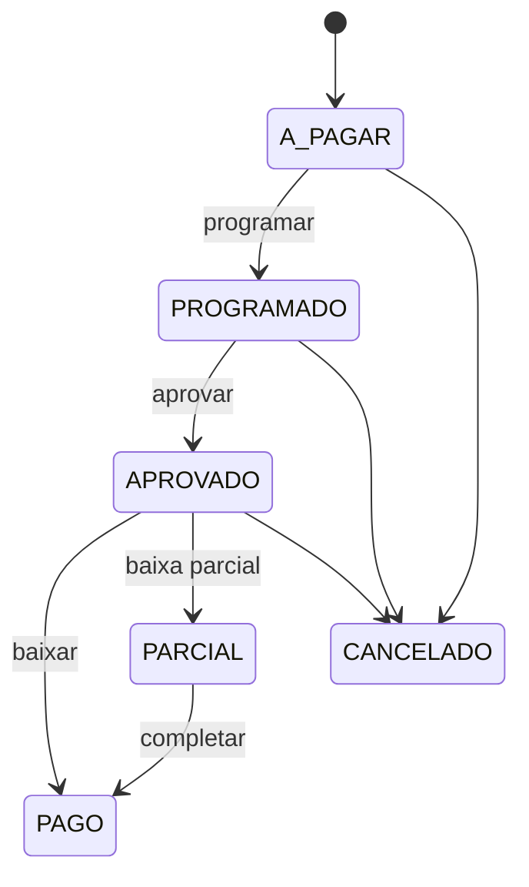

# Máquinas de estado

## Princípio

Estado não é campo livre. Transição é explícita, permissionada e auditada.

E são **pequenas**: não há motor genérico de workflow. Cada transição é um método de serviço com nome próprio, que qualquer um consegue ler.

## O ciclo padrão

Vale igual para `Purchase`, `Sale`, `HerdMovement`, `CostEntry` e `Weighing`. Um só ciclo, aprendido uma vez.



| Transição | Permissão | O que faz |
|---|---|---|
| `confirmar` | `<app>.confirm_<modelo>` | Aplica os efeitos. Transacional |
| `editar` | `<app>.change_<modelo>` | Desfaz os efeitos antigos, aplica os novos. **Motivo obrigatório** |
| `excluir` | `<app>.delete_<modelo>` | Desfaz todos os efeitos. **Motivo obrigatório.** Exclusão lógica |
| `restaurar` | `<app>.restore_<modelo>` | Reaplica os efeitos |

Não existem mais `CANCELADA` nem `ESTORNADA`: exclusão cobre os dois casos.

Regra completa, com análise de impacto, cascata e bloqueios: [regras-negocio/06](../regras-negocio/06-edicao-exclusao-e-auditoria.md).

### Compra
`confirmar` cria o lote, o movimento de entrada e os lançamentos de custo, tudo em uma transação.

### Venda / Abate
`confirmar` verifica saldo **dentro da transação, com a posição travada**. Fora disso, duas vendas simultâneas derrubam o saldo abaixo de zero.

### Movimentação de rebanho
Editar ou excluir escreve **linhas de compensação no razão**, com a data do fato original. O razão nunca perde linha. Movimento gerado por compra ou venda se corrige pelo documento de origem, não direto.

## Lote



Encerramento é **automático** quando o saldo zera, com `exit_date` preenchida. Reabrir exige permissão e fica auditado — o resultado já congelado passa a ser recalculado.

## Safra



Safra encerrada recusa lançamento novo. Reabertura é evento de auditoria de alta severidade: muda números que já foram usados para decidir.

## Importação



Importação é transacional: falhou no meio, nada entrou. `file_hash` impede reimportar o mesmo arquivo sem confirmação explícita.

## Títulos financeiros (Fase 4)



Separação deliberada entre **aprovar** e **pagar**: quem aprova não é quem executa.

> **Como ficou (Fase 4):** o título tem dois ciclos — o do registro (`CONFIRMADA`/`EXCLUIDA`; **`CANCELADO` é exclusão**, não um estado à parte) e o do dinheiro, acima. Título **a receber** (venda) não programa nem aprova: baixa direto de `A_PAGAR`. Desfazer a baixa devolve o título ao estado anterior. Regras completas em [regras-negocio/07](../regras-negocio/07-financeiro.md).

Baixa é idempotente: chave por `(título, documento de pagamento)`. Clique duplo não paga duas vezes.

**Título com baixa é a única exceção ao "tudo é editável".** Não que o registro seja intocável — é que desfazer no sistema não desfaz a transferência no banco. Desfazer uma baixa é operação de `FINANCEIRO` ou `ADMIN`, com motivo, e **bloqueia a exclusão de qualquer coisa a montante** até ser desfeita. Ver [regras-negocio/06](../regras-negocio/06-edicao-exclusao-e-auditoria.md#o-que-bloqueia).

## Regras gerais

1. **Toda transição registra** ator, data/hora, estado anterior, novo estado e motivo quando houver
2. **Toda transição verifica permissão** — nunca só `is_staff`
3. **Toda transição que escreve em mais de uma tabela é atômica**
4. **Estado atual é lido sob trava** antes de mudar, nas operações críticas
5. **Não se pula etapa.** Sem exceção silenciosa
6. **Desfazer uma ação desfaz os efeitos dela** — e mostra o impacto antes de executar

## Como implementar

Sem biblioteca de máquina de estados. Método explícito no serviço:

```python
# apps/purchases/services.py
@transaction.atomic
def confirmar_compra(compra, *, usuario):
    compra = Purchase.objects.select_for_update().get(pk=compra.pk)

    if compra.status != Purchase.Status.RASCUNHO:
        raise BusinessError("Esta compra já foi confirmada.")
    if not usuario.has_perm("purchases.confirm_purchase"):
        raise PermissionDenied

    ...  # efeitos

    compra.status = Purchase.Status.CONFIRMADA
    compra.save(update_fields=["status"])
    registrar_evento(compra, "Compra confirmada", usuario=usuario)
```

Legível, testável, e o `select_for_update` no início é o que impede a duplicidade por clique duplo.
