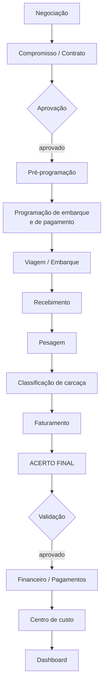

# Fluxo do ciclo de compra (Fase 5)

> **Implementado antecipadamente (2026-10-02)** — a regra do que foi construído está em [regras-negocio/08](../regras-negocio/08-ciclo-de-compra.md) e o desenho em [ADR 0008](../arquitetura/adr/0008-ciclo-de-compra-por-composicao.md). Este documento segue como a descrição do ciclo **do legado**; onde diverge (item → compra, etapa derivada, trava como `bloqueios()`), vale o ADR.

> **Parte do escopo principal** (decisão de Warley, 2026-10-02). Descreve o ciclo do sistema SisAtak, do frigorífico Boi Brasil, a partir dos 5 relatórios legados e do `Sistema_Gestao_Pasto_Compra_Gado_Estrutura_Funcional.md` — este último é a fonte principal do escopo. Para saber o que já está no sistema e o que falta, ver [04-alinhamento-ao-doc-funcional](04-alinhamento-ao-doc-funcional.md).

## Por que está documentado

O material original do projeto descreve quase inteiramente este fluxo. É um bom escopo — para outro negócio. A decisão de tratá-lo como Fase 5 está em [00-visao-geral](../00-visao-geral.md).

Duas razões para mantê-lo:

1. A compra faz parte da gestão a pasto: é este o fluxo que leva o gado do produtor até o rebanho, o custo e o financeiro.
2. O relatório `06_Historico_de_Abate_por_Pecuarista` já mostra indicadores (`R$ @`, `Custo @`) que o nosso resultado por lote precisa na Fase 3.

## O ciclo completo

Estados: `EM NEGOCIAÇÃO → PROGRAMADA → AGUARDANDO APROVAÇÃO → COMPROMISSO APROVADO → EM PROGRAMAÇÃO DE EMBARQUE → EMBARCADA → RECEBIDA → EM CONFERÊNCIA → EM FATURAMENTO → EM ACERTO → ACERTO APROVADO → AGUARDANDO FINANCEIRO → PAGAMENTO PROGRAMADO → PAGO → ENCERRADA`, mais `CANCELADA`.

> Esses são os estados do **sistema legado**. Se a Fase 5 for construída, ela adota a mesma mecânica de edição e exclusão do resto do Rebanho360 ([regras-negocio/06](../regras-negocio/06-edicao-exclusao-e-auditoria.md)): `CANCELADA` vira `EXCLUÍDA`, e a trava de fechamento do acerto entra como **bloqueio na análise de impacto**, não como estado separado.

## Como encaixa no que já existe

A chave de tê-lo documentado agora: o modelo do núcleo **não precisa mudar** para recebê-lo.

Hoje a compra é `RASCUNHO → CONFIRMADA`. A Fase 5 acrescenta os estados **entre** os dois. `CONFIRMADA` passa a ser alcançada depois do acerto aprovado, em vez de direto. O que já funciona continua funcionando.

Entidades novas, todas penduradas na `Purchase` existente: `Commitment` (compromisso/contrato) · `Shipment` (programação) · `Trip` (viagem) · `Receiving` (recebimento) · `CarcassGrading` (classificação) · `Settlement` (acerto) · `Commission` · `Freight`.

## Conceitos que o núcleo não tem

### Preço por faixa
O contrato negocia até 5 faixas por produto (ex.: 216,00 / 237,60 / 248,40 / 270,00 / 270,00). A faixa aplicada depende da classificação da carcaça no abate. **Pendência #8.**

### Classificação de carcaça
Do relatório de conferência: Magro, Gordura Ausente, Gordura Escassa, Gordura Mediana, Gordura Uniforme, Lesão Traumática. **Cadastro parametrizável**, nunca fixo no código.

### Romaneio valorizado
Detalhamento por produto × classificação × faixa de peso, com cabeças, peso, média @, valor/@, valor/kg, % desconto e valor líquido. É o documento que fecha o valor a pagar ao produtor.

### Tributos e taxas
Funrural · Fundepec · GTA · ICMS · taxa de abate · indenização · Incentivo Precoce · Idaterra · crédito GR-3.

> **Nada disso se implementa por dedução.** Regra tributária mal implementada gera passivo. Cada uma precisa ser confirmada com o contador antes de virar código.

### Acerto final
Previsto × realizado em quantidade, peso, categoria, preço, valor, frete, comissão e datas. Consolida animais, frete, comissão, tributos, taxas, despesas, descontos, adiantamentos e créditos até o líquido.

**Trava de fechamento:** acerto aprovado impede edição dos valores. Corrigir exige reabertura formal, com registro de quem, quando e por quê, e recálculo das obrigações ligadas.

### Comissão por comprador
Regra por comprador, produto, operação e vigência. **Com snapshot**: a regra aplicada fica gravada na operação. Mudar o cadastro hoje não pode alterar uma operação de janeiro. **Pendência #4.**

## Documentos gerados

Contrato de compra · Programação de embarque · Programação de abate · Programação de pagamentos · Conferência do acerto · Acerto final · Relatório de comissão · Histórico por pecuarista.

Todos a partir dos dados já registrados, sem redigitação, com versão de template guardada.

## Se a Fase 5 acontecer

1. Reler os 5 PNGs em `docs/fontes/relatorios-legado/`
2. Confirmar as pendências #4 e #8
3. **Confirmar toda regra tributária com o contador** — nada por dedução
4. Modelar `Commitment`, `Trip`, `Receiving`, `Settlement` pendurados na `Purchase`
5. Estender a máquina de estados sem quebrar `RASCUNHO → CONFIRMADA`
6. Snapshot de regra comercial desde o primeiro dia
