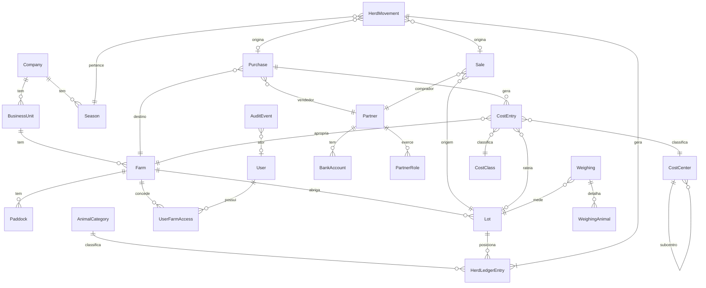

# Modelo de dados

Nomes de classe e campo em **inglês**; rótulos de tela em **português**. Correspondência em [02-vocabulario](02-vocabulario.md).

## Diagrama

## Espinha organizacional

### `Company` — Empresa
`name`, `legal_name`, `tax_id` (CNPJ), `address`, `city`, `state`, `phone`, `is_active`

### `BusinessUnit` — Unidade
`company`, `name`, `code`, `is_active`

Agrupa fazendas por região ou por operação. Pode haver só uma.

### `Season` — Safra
`company`, `name` (`2025/2026`), `start_date`, `end_date`, `status` (`ABERTA` / `ENCERRADA`), `is_current`

Eixo de comparação de todo o negócio. Toda transação carrega safra, derivada da data e confirmável pelo usuário. Constraint: safras da mesma empresa não se sobrepõem.

### `Farm` — Fazenda
`business_unit`, `name`, `code`, `city`, `state`, `total_area_ha`, `pasture_area_ha`, `is_active`

Semear com: São Francisco, São Francisco II, Goiano, Baixão, Morada do Boi, São José do Grotão. *(Ver pendência #5 sobre São Francisco vs São Francisco II.)*

### `Paddock` — Área / Pasto
`farm`, `name`, `area_ha`, `type` (`PASTAGEM`, `SILAGEM`, `BENFEITORIA`, `RESERVA_APP`, `ARRENDAMENTO`), `capacity_ua`, `is_active`

Categorias vindas da aba `TABELA DE ÁREAS` da REPORTAGEM IVAN.

## Pessoas e acesso

### `User`
Estende `AbstractUser`. Acrescenta `role`, `phone`, `birth_date` (opcional), `cpf` (opcional, 11 dígitos, único entre contas não excluídas), `is_active`, `last_login_ip`, `must_change_password` e `deleted_at` (exclusão lógica).

Papéis: `ADMIN`, `GESTOR`, `ESCRITORIO`, `CAMPO`, `FINANCEIRO`, `CONSULTA`.

### `UserFarmAccess` — Acesso por fazenda
`user`, `farm`, `can_write`

O papel define **o quê**; esta tabela define **onde**. Usuário sem nenhuma linha aqui não enxerga fazenda alguma — exceto `ADMIN` e `GESTOR`, que têm acesso amplo por definição do papel. Ver [ADR 0003](../arquitetura/adr/0003-escopo-por-fazenda-desde-a-fase-0.md).

### `Partner` — Parceiro
`name`, `legal_name`, `trade_name`, `document` (CPF/CNPJ), `address`, `city`, `state`, `phone`, `email`, `notes`, `is_active`

### `PartnerRole` — Papel do parceiro
`partner`, `role`

Papéis: `PRODUTOR`, `FORNECEDOR`, `COMPRADOR`, `FRIGORIFICO`, `TRANSPORTADOR`, `MOTORISTA`, `COMISSIONADO`, `FAVORECIDO`, `PECUARISTA`.

**Um parceiro, vários papéis.** Nunca duplicar a pessoa porque ela vende e compra. Constraint única em `(partner, role)`.

### `BankAccount` — Conta bancária
`partner`, `bank_code`, `bank_name`, `branch`, `account`, `account_type`, `pix_key`, `is_default`

Dado sensível: nunca aparece em log, e alteração aqui é evento de auditoria de alta severidade.

## Rebanho

### `AnimalCategory` — Categoria animal
`name`, `sex` (`M`/`F`/`—`), `age_order`, `display_order`, `is_active`

As 11 categorias reais. `age_order` alimenta a sugestão de evolução.

### `Breed` — Raça
`name`, `is_active` — semear com Nelore.

### `Lot` — Lote
`code`, `farm`, `origin_purchase`, `origin_partner`, `entry_date`, `exit_date`, `breed`, `cost_center`, `season`, `notes`, `status` (`ABERTO` / `ENCERRADO`)

Unidade de custeio e de análise de desempenho. Quantidade, peso e categoria **não** são campos do lote — saem do razão.

### `HerdMovement` e `HerdLedgerEntry`

Detalhados em [regras-negocio/01](../regras-negocio/01-rebanho-movimentacoes.md). O par mais importante do sistema.

O razão é **append-only**: editar ou excluir um movimento escreve linhas de compensação, nunca apaga linhas. Por isso `HerdLedgerEntry` separa dois tempos:

| Campo | Significado | Usado para |
|---|---|---|
| `date` | Quando o fato aconteceu | **Cálculo de saldo** |
| `created_at` | Quando foi registrado | **Auditoria** |
| `reverses_entry` | FK para a linha compensada | Rastreio da correção |

A linha de compensação leva a **data do fato original**, para que a correção valha para trás: se a contagem errada foi de setembro, o saldo de setembro passa a estar certo.

### `Weighing` — Pesagem
`date`, `farm`, `lot`, `reason`, `head_count`, `total_weight_kg`, `created_by`

Motivos observados na planilha: `CONFERENCIA`, `COMPRA`, `ABATE`, `VACINA`, `VENDA`.

### `WeighingAnimal` — Pesagem individual
`weighing`, `ear_tag`, `weight_kg`

Preserva os dados de brinco da planilha. Sem entidade `Animal` na v1.

## Custos

### `CostClass` — Classe de custo
`name`, `is_active` — semear: `CUSTEIO`, `INVESTIMENTO`.

### `CostCenter` — Centro de custo
`name`, `parent`, `is_active`

Auto-relacionamento para subcentro. Semear com os 11 reais: FUNCIONÁRIO, PARQUE DE MÁQUINAS, DESPESA GADO, INFRAESTRUTURA, NUTRIÇÃO, PASTAGEM, IMPOSTO E TAXAS, COMISSÃO, SANIDADE, OUTROS, FERPAM.

### `CostEntry` — Lançamento de custo
`date`, `payer`, `description`, `amount`, `cost_center`, `cost_class`, `farm`, `season`, `lot`, `source_purchase`, `notes`, `created_by`

`farm` e `season` são obrigatórios — é assim que o negócio analisa. `lot` é opcional; quando preenchido, o custo é direto do lote. Quando vazio, `CostAllocationService` rateia por cabeça-dia.

## Compra e venda

### `Purchase` — Compra
`code` (`CP-2025/26-0001`), `date`, `seller`, `destination_farm`, `lot`, `category`, `head_count`, `total_weight_kg`, `animal_value`, `freight_value`, `commission_value`, `tax_value`, `payment_days`, `season`, `partnership`, `status`, `notes`

Estados na v1: `RASCUNHO → CONFIRMADA → EXCLUÍDA`, editável e restaurável. Confirmar gera, na mesma transação, o movimento de entrada no rebanho **e** os lançamentos de custo de frete, comissão e impostos.

`total_cost = animal_value + freight_value + commission_value + tax_value` — calculado, nunca digitado.

### `Sale` — Venda / Abate
`code`, `date`, `type` (`ABATE` / `VENDA`), `buyer`, `farm`, `lot`, `category`, `head_count`, `total_weight_kg`, `carcass_weight_kg`, `total_value`, `sale_form` (`PASTO` / `CONFINAMENTO`), `payment_days`, `season`, `partnership`, `status`, `notes`

Derivados por `CarcassService`, nunca campos: peso médio, carcaça média, rendimento %, valor/cabeça, valor/@.

Constraints no banco (Fase 3): `head_count`, `total_weight_kg` e `total_value` > 0; `carcass_weight_kg` nulo ou > 0 e **< peso vivo**; carcaça só quando `type = ABATE`. `HerdMovement.origin_sale` aponta a venda que gerou (ou adotou) a saída.

> Na planilha, `RENDIMENTO %` existe como coluna **e** como fórmula, com divergência entre as duas. Ver pendência #7.

## Financeiro (Fase 4)

### `Invoice` — Título
`code` (`TT-2025/26-0001`), `direction` (`PAGAR` / `RECEBER`), `component` (`ANIMAIS` · `FRETE` · `COMISSAO` · `IMPOSTOS` · `VENDA` · `OUTRO`), `season`, `farm`, `payee` (favorecido, anulável), `bank_account` (do favorecido), `origin_purchase` / `origin_sale`, `document`, `issue_date`, `due_date`, `amount`, `payment_status` (`A_PAGAR` · `PROGRAMADO` · `APROVADO` · `PARCIAL` · `PAGO`), `scheduled_date`, `scheduled_by`, `approved_by`, `approved_at`, `voided_with_origin`, `notes` + os campos de `ReversibleModel` (`status`, `version`, exclusão lógica).

Constraints: `amount > 0` · `due_date ≥ issue_date` · uma origem só · **`UNIQUE (origin_purchase, component)` e `UNIQUE (origin_sale, component)`** — a chave de idempotência da geração. Pago, falta e vencido são calculados das baixas, nunca gravados. Ver [regras-negocio/07](../regras-negocio/07-financeiro.md).

### `Payment` — Baixa
`code` (`PG-2025/26-0001` pagamento, `RC-…` recebimento), `invoice`, `date`, `amount`, `method` (`PIX` · `TED` · `BOLETO` · `CHEQUE` · `DINHEIRO` · `OUTRO`), `document` (obrigatório), `notes` + `ReversibleModel`.

Constraints: `amount > 0` · `document` não vazio · **`UNIQUE (invoice, document)` enquanto a baixa não foi desfeita** — a chave de idempotência da baixa.

### `TOTPDevice` e `RecoveryCode` (`accounts`)
Segundo fator. `TOTPDevice`: `user` (1:1), `secret`, `confirmed`, `last_used_step` (anti-replay). `RecoveryCode`: `user`, `code_hash` (HMAC, nunca o código), `used_at`. O segredo nunca entra em log, auditoria ou URL.

### `TrustedDevice` (`accounts`)
Navegador que o usuário marcou como confiável ao confirmar o código (ADR 0009). `user`, `token_hash` (HMAC, único; o token só existe no cookie), `label`, `user_agent`, `created_ip`, `last_ip`, `last_used_at`, `expires_at` (janela de 30 dias, renovada a cada uso), `absolute_expires_at` (teto de 90 dias; `CHECK expires_at <= absolute_expires_at`), `revoked_at`, `revoked_reason`. Não é exportável.

## Ciclo de compra (Fase 5)

Nenhuma coluna nova em `Purchase`, `Lot`, `CostEntry`, `HerdMovement` ou `Invoice`. Regra em [08](../regras-negocio/08-ciclo-de-compra.md).

**`commercial` — cadastros:** `CarcassClass` (código, nome, ordem, `default_band` opcional) · `TaxType` (nome, natureza `TRIBUTO`/`TAXA`/`DESCONTO`/`ADIANTAMENTO`/`CREDITO`; **sem alíquota**) · `CommissionRule` (comissionado, categoria, tipo `PERCENTUAL`/`POR_CABECA`, base `BRUTO`/`LIQUIDO`, valor, vigência).

**`procurement` — o ciclo:**

| Entidade | Resumo |
|---|---|
| `Commitment` | `code` (`CM-`), data, safra, produtor, fazenda de destino, comprador, programação (retirada, abate, caminhões, distância), `payment_days`, aprovação. `ReversibleModel` |
| `CommitmentItem` | Categoria, cabeças, peso médio, base do preço (`ARROBA`/`CABECA`), faixas 1–5 ou preço por cabeça, `purchase` (**a única ligação com o núcleo**) |
| `Commission` | **Snapshot** da regra aplicada (tipo, base, valor, favorecido, comissão extra). 1:1 com o compromisso |
| `Trip`, `TripLoad` | Viagem (`VG-`): transportador, motorista, placa, critério/tarifa/realizado do frete; carga programada × embarcada |
| `Receiving`, `ReceivingLine` | Recebimento (`RB-`), um por viagem: cabeças, peso, categoria recebida, ocorrência |
| `GradingLine` | Linha do romaneio: classificação, faixa 1–5, cabeças, peso de carcaça, preço da @, desconto % |
| `Settlement`, `SettlementLine`, `FiscalNote` | Acerto (`AC-`), um ativo por compromisso; linhas digitadas por `TaxType`; notas fiscais **registradas** |

As **linhas** (`LineModel`) nunca saem do banco: `removed_at` as tira da operação. Média @, valores, totais, frete previsto, quebra, comissão em reais e a **etapa** do compromisso são **derivados**, nunca campos.

## Auditoria

### `AuditEvent`

| Campo | Nota |
|---|---|
| `timestamp` | Com fuso |
| `actor` | Quem fez |
| `action` | `CREATE` · `UPDATE` · `DELETE` · `RESTORE` · `CONFIRM` · `APPROVE` · `LOGIN` · `EXPORT` · `VIEW` (consulta a dado bancário) |
| `entity_type`, `entity_id` | O registro afetado |
| `before`, `after` | JSON do estado anterior e novo |
| `changed_fields` | Lista dos campos que mudaram |
| `reason` | **Motivo informado pelo usuário** — obrigatório em UPDATE e DELETE |
| `cascade_root` | UUID da ação que originou a cascata, quando houver |
| `ip_address`, `user_agent`, `request_id` | Contexto técnico |

**Append-only.** Sem tela, sem método de serviço, e no banco o papel da aplicação tem apenas `INSERT` e `SELECT`. Nem `ADMIN` altera ou apaga. Ver [ADR 0006](../arquitetura/adr/0006-tudo-editavel-com-auditoria-imutavel.md).

`request_id` e `cascade_root` são o que permite ler uma exclusão em cascata como **um** ato, não como sete eventos soltos.

### `GeneratedDocument` (`documents`)
`document_id` (UUID), `doc_type`, `entity_type`, `entity_id`, `title`, `template_version`, `status` (`PENDENTE` · `PRONTO` · `ERRO`), `params`, `filters`, `file`, `file_hash` (SHA-256), `size_bytes`, `error`, `generated_by`, `generated_at`, `finished_at`

O PDF que vira papel, guardado com o que é preciso para saber o que foi impresso, por quem e quando.

### `OperationEvent`
`timestamp`, `actor`, `entity_type`, `entity_id`, `title`, `description`, `previous_status`, `new_status`, `document`

A linha do tempo que o usuário lê.

## Campos comuns a todo registro transacional

`Purchase`, `Sale`, `HerdMovement`, `CostEntry` e `Weighing` herdam de um mixin com:

| Campo | Nota |
|---|---|
| `status` | `RASCUNHO` · `CONFIRMADA` · `EXCLUIDA` |
| `deleted_at`, `deleted_by`, `delete_reason` | Exclusão lógica |
| `version` | Incrementa a cada edição; aparece na tela como "Editada (v3)" |
| `created_by`, `created_at`, `updated_by`, `updated_at` | |

Nenhum registro sai do banco. Regra em [regras-negocio/06](../regras-negocio/06-edicao-exclusao-e-auditoria.md).

## Importação

### `ImportBatch`
`file`, `file_hash`, `importer`, `status` (`CARREGADO` → `VALIDADO` → `CONFIRMADO` → `IMPORTADO` / `CANCELADO`), `total_rows`, `valid_rows`, `error_rows`, `created_by`, `created_at`

### `ImportRow`
`batch`, `row_number`, `raw_data` (JSON), `status` (`VALIDA` / `ERRO` / `PENDENTE`), `errors` (JSON), `created_object_type`, `created_object_id`

`file_hash` impede importar o mesmo arquivo duas vezes sem confirmação explícita.

## Índices

Criar apenas os que consultas reais pedem:

| Tabela | Índice |
|---|---|
| `HerdLedgerEntry` | `(farm, category, date)`, `(lot, date)`, `(season)`, `reverses_entry` |
| `CostEntry` | `(farm, season, date)`, `(cost_center, season)`, `(lot)` |
| `Purchase` | `(season, date)`, `(destination_farm, date)`, `code` único |
| `Sale` | `(season, date)`, `(lot)`, `code` único |
| `AuditEvent` | `(entity_type, entity_id)`, `(actor, timestamp)`, `request_id`, `cascade_root` |

Toda listagem filtra `status != EXCLUIDA` por padrão — incluir `status` nos índices compostos das tabelas transacionais.
