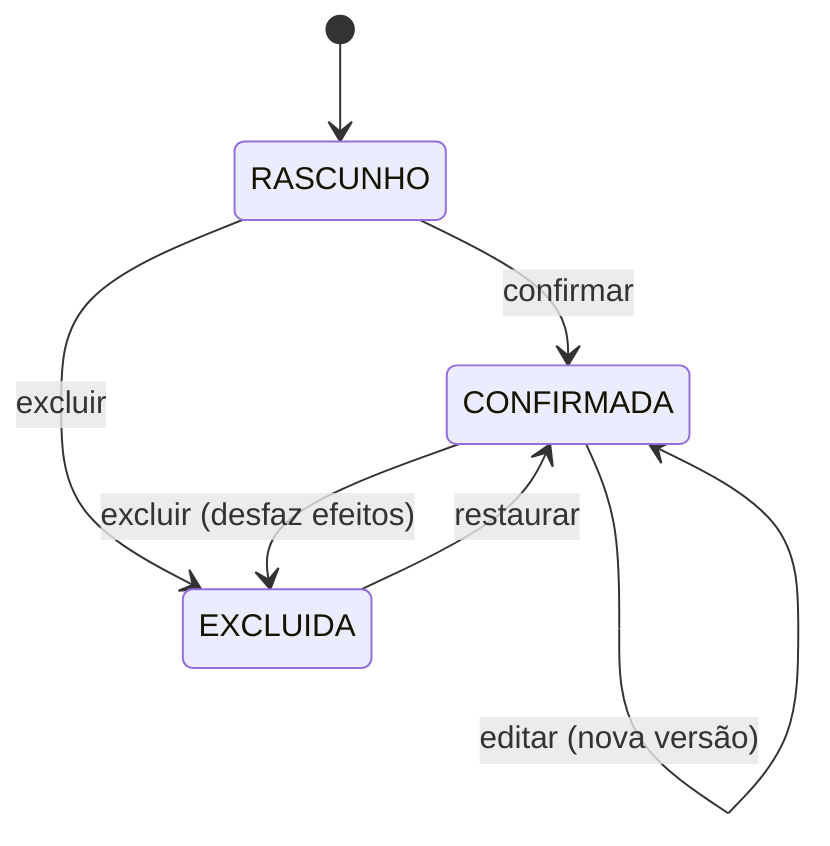

# Edição, exclusão e auditoria

> Regra transversal. Vale para **toda** ação transacional do sistema: movimentação de rebanho, compra, venda, abate, pesagem, lançamento de custo, título, pagamento, importação.

## O princípio

**Toda ação pode ser editada e excluída. Ao desfazer uma ação, todos os efeitos dela são desfeitos junto. Nada se perde: tudo fica registrado em auditoria, visível ao administrador.**

Três operações disponíveis em qualquer registro:

| Operação | O que faz |
|---|---|
| **Editar** | Muda os dados. Os efeitos da versão anterior são desfeitos e os da nova são aplicados, na mesma transação |
| **Excluir** | Desfaz todos os efeitos e retira o registro da operação. O registro **continua no banco**, em estado `EXCLUÍDO` |
| **Restaurar** | Desfaz a exclusão e reaplica os efeitos |

Nenhuma delas apaga linha do banco. "Excluir" é exclusão lógica — o registro sai da operação, não da história.

## O que é "desfazer os efeitos"

Toda ação declara o que produziu. O sistema sabe desfazer porque sabe o que fez.

```
Compra CP-2025/26-0013
  ├─ HerdMovement MV-...-004871   +126 cabeças no lote LT-SFR-014
  ├─ CostEntry #2041              R$ 388.080,00 · DESPESA GADO
  ├─ CostEntry #2042              R$   4.500,00 · DESPESA GADO (frete)
  └─ Lot LT-SFR-014               criado por esta compra
```

Excluir a compra desfaz os quatro, em uma transação. O lote criado por ela é excluído junto se não tiver nada além disso; se já recebeu outras entradas, permanece.

O vínculo já existe no modelo: `HerdMovement.documento_origem`, `CostEntry.source_purchase`, `Lot.origin_purchase`. Nenhuma tabela nova é necessária para saber o que desfazer.

## Como o razão do rebanho lida com isso

Ponto delicado, porque o saldo é derivado do razão. Ver [01-rebanho-movimentacoes](01-rebanho-movimentacoes.md).

**O razão é append-only. Desfazer escreve linhas de compensação, nunca apaga linhas.**

E a linha de compensação leva **a data do fato original**, não a data da correção:

```
Lançado em 20/09  →  entry #801   data 18/09   +126   (compra original)
Corrigido em 14/10 → entry #1150  data 18/09   −126   reverte #801
                     entry #1151  data 18/09   +120   valor correto
```

Por que a data do fato: se alguém errou a digitação em setembro, o saldo de setembro **nunca foi** 126 — foi 120. A correção precisa valer para trás.

Isso exige dois campos de tempo distintos em `HerdLedgerEntry`:

| Campo | Significado | Usado para |
|---|---|---|
| `date` | Quando o fato aconteceu | **Cálculo de saldo** |
| `created_at` | Quando foi registrado no sistema | **Auditoria** |
| `reverses_entry` | FK para a linha que esta compensa | Rastreio da correção |

Saldo consulta `date`. Auditoria consulta `created_at`. São perguntas diferentes:

- *"Quantas cabeças havia em 30/09?"* → 120. Sempre foi.
- *"O que o sistema mostrava em 30/09?"* → 126, até a correção de 14/10 feita pela Maria.

As duas respostas ficam disponíveis. A segunda é o que a auditoria entrega.

## Análise de impacto

Antes de editar ou excluir, o sistema verifica o que depende do registro e **mostra ao usuário antes de executar**.

```
EXCLUIR COMPRA CP-2025/26-0013

Isto vai desfazer:
  · entrada de 126 cabeças no lote LT-SFR-014
  · R$ 388.080,00 em DESPESA GADO
  · R$   4.500,00 em frete
  · o lote LT-SFR-014 (criado por esta compra, sem outras entradas)

⚠ 2 registros dependem desta compra:
  · Pesagem de 12/11/2025 · 126 cb · lote LT-SFR-014
  · Venda VD-2025/26-0004 · 81 cb  · lote LT-SFR-014

Motivo da exclusão: [________________________]

        [ Cancelar ]   [ Excluir em cascata ]
```

Três desfechos possíveis:

**1. Sem dependência** → executa direto, com o motivo registrado.

**2. Com dependência reversível** → oferece **cascata explícita**. O usuário vê a lista completa e confirma. Tudo é desfeito na mesma transação, e cada item desfeito gera seu próprio evento de auditoria.

**3. Com dependência bloqueante** → recusa, explicando o que remover primeiro:

> **Não é possível excluir esta compra.**
>
> O lote LT-SFR-014 foi vendido na VD-2025/26-0004, e o pagamento dessa venda já foi baixado em 20/04/2026.
>
> Para prosseguir, é preciso antes desfazer a baixa do pagamento.

### O que bloqueia

| Situação | Por quê |
|---|---|
| Pagamento já baixado | Dinheiro saiu de verdade; desfazer no sistema não desfaz no banco. **Implementado na Fase 4** — a mensagem leva o link para a baixa ([07](07-financeiro.md#desfazer-baixa-e-o-que-ela-bloqueia-f4-05)) |
| Safra encerrada | Números já usados para decidir. Exige reabrir a safra (permissão de `ADMIN`) |
| Saldo ficaria negativo | Invariante do rebanho. A cascata resolve; sem cascata, bloqueia |
| Documento fiscal emitido | Se houver NF vinculada (Fase 5) |

Bloqueio nunca é definitivo: sempre há um caminho, e o sistema diz qual é. O que não existe é desfazer em silêncio algo que deixaria o sistema inconsistente.

## Permissões

| Operação | Papel | Observação |
|---|---|---|
| Editar rascunho próprio | qualquer, dentro do escopo | |
| Editar registro confirmado | `ESCRITORIO`, `GESTOR`, `ADMIN` | **Motivo obrigatório** |
| Excluir registro confirmado | `GESTOR`, `ADMIN` | **Motivo obrigatório** |
| Excluir em cascata | `GESTOR`, `ADMIN` | Confirmação com a lista completa |
| Restaurar | `GESTOR`, `ADMIN` | |
| Desfazer baixa de pagamento | `FINANCEIRO`, `ADMIN` | **Motivo obrigatório** — Fase 4, [07](07-financeiro.md) |
| Editar/excluir em safra encerrada | `ADMIN` | Exige reabrir a safra antes |
| Ver auditoria | `ADMIN` | Configurável para incluir `GESTOR` |

Motivo é campo obrigatório de texto em toda edição e exclusão de registro confirmado. Sem motivo, a operação não é aceita — não é formalidade: é o que torna a auditoria legível meses depois.

## Auditoria

Com tudo editável e apagável, **a auditoria é a única garantia de que o histórico é verdadeiro**. Ela precisa ser mais forte que os dados que protege.

### Imutável, inclusive para o administrador

`AuditEvent` é **append-only**:

- Não há tela de edição nem de exclusão. Nem para `ADMIN`
- Não há método de serviço que altere ou remova um evento
- No banco, o papel da aplicação recebe apenas `INSERT` e `SELECT` na tabela — sem `UPDATE` nem `DELETE`
- Constraint de banco impede alteração de evento já gravado

O administrador pode apagar qualquer dado de negócio. **Não pode apagar o registro de que apagou.**

### O que cada evento guarda

```
AuditEvent
  id                  sequencial, sem lacuna
  timestamp           com fuso
  actor               quem fez
  action              CREATE · UPDATE · DELETE · RESTORE · CONFIRM · APPROVE · LOGIN · EXPORT
  entity_type         "Purchase"
  entity_id
  before              JSON do estado anterior
  after               JSON do estado novo
  changed_fields      lista dos campos que mudaram
  reason              motivo informado pelo usuário
  cascade_root        quando faz parte de uma cascata, aponta para a ação que a originou
  ip_address
  user_agent
  request_id          liga todos os eventos de uma mesma requisição
```

`request_id` e `cascade_root` são o que permite ler uma exclusão em cascata como **um** ato, e não como sete eventos soltos.

### Console de auditoria

Tela para `ADMIN`, na Fase 0:

```
AUDITORIA                                        Safra 2025/2026

Usuário [ Todos ▾ ]  Ação [ Todas ▾ ]  Entidade [ Todas ▾ ]
Período [ 01/04 – 30/04 ]  IP [ ]              [ Exportar CSV ]

14/10/2026 09:32  Maria   EXCLUIU   Compra CP-2025/26-0013
                  Motivo: "Duplicada — mesma nota da CP-0012"
                  Em cascata: 1 movimentação, 2 custos, 1 lote
                  [ ver detalhes ]  [ restaurar ]

14/10/2026 09:15  Maria   ALTEROU   Movimentação MV-2025/26-004871
                  Motivo: "Contagem corrigida no curral"
                  quantidade   126 → 120
                  peso_total  26.208 → 24.960
                  [ ver detalhes ]

14/10/2026 08:02  José    CRIOU     Pesagem 12/11/2025 · lote LT-SFR-014
```

Recursos: filtro por usuário, ação, entidade, período e IP · diff campo a campo · agrupamento de cascata · **restaurar a partir do evento** · exportação CSV · linha do tempo de um registro específico ("tudo que já aconteceu com esta compra").

### O que auditar sempre

Criação, edição, exclusão e restauração de qualquer registro transacional · confirmação e aprovação · login, logout e falha de autenticação · **troca de senha e edição do próprio perfil** (sem valor de senha; CPF mascarado) · **alteração de dado bancário** (severidade alta) · mudança de permissão ou de escopo de usuário · importação e cancelamento de importação · geração de documento · exportação de dados em massa · reabertura de safra.

### Retenção

Eventos de auditoria **nunca são apagados**. Entram no backup diário como o resto.

Se a tabela crescer demais — não é a expectativa neste volume —, o caminho é particionar por ano, não expurgar.

## Efeito nas máquinas de estado

Simplificam. `ESTORNADA` e `CANCELADA` deixam de existir: exclusão cobre os dois casos.



Vale igual para `Purchase`, `Sale`, `HerdMovement`, `CostEntry` e `Weighing`.

## Como implementar

Um mixin, um contrato. Cada serviço declara como aplica e como desfaz seus efeitos.

```python
# apps/core/reversible.py
class ReversibleAction:
    """Contrato de toda ação que produz efeitos desfazíveis."""

    def aplicar_efeitos(self, *, usuario): ...
    def desfazer_efeitos(self, *, usuario): ...
    def dependentes(self) -> list: ...


@transaction.atomic
def editar(registro, dados, *, usuario, motivo):
    registro = type(registro).objects.select_for_update().get(pk=registro.pk)
    antes = snapshot(registro)

    bloqueios = verificar_bloqueios(registro)
    if bloqueios:
        raise BusinessError(explicar(bloqueios))

    registro.desfazer_efeitos(usuario=usuario)
    aplicar_dados(registro, dados)
    registro.aplicar_efeitos(usuario=usuario)

    registrar_auditoria(
        action="UPDATE", entity=registro,
        before=antes, after=snapshot(registro),
        reason=motivo, usuario=usuario,
    )


@transaction.atomic
def excluir(registro, *, usuario, motivo, cascata=False):
    registro = type(registro).objects.select_for_update().get(pk=registro.pk)

    deps = registro.dependentes()
    if deps and not cascata:
        raise DependencyError(deps)     # a view transforma na tela de impacto

    raiz = uuid4()
    for dep in deps:
        excluir(dep, usuario=usuario, motivo=motivo, cascata=True, raiz=raiz)

    registro.desfazer_efeitos(usuario=usuario)
    registro.status = Status.EXCLUIDA
    registro.save(update_fields=["status"])

    registrar_auditoria(
        action="DELETE", entity=registro,
        before=snapshot(registro), after=None,
        reason=motivo, cascade_root=raiz, usuario=usuario,
    )
```

Pontos que não podem faltar: `select_for_update` no início · tudo dentro de `transaction.atomic` · bloqueios verificados **dentro** da transação · auditoria gravada na mesma transação (auditoria que falha e deixa o dado passar é pior que não ter auditoria).

## Testes obrigatórios

1. Editar compra confirmada corrige saldo e custos, e o saldo **na data original** reflete a correção
2. Excluir compra desfaz movimento, custos e lote
3. Excluir com dependente e sem cascata é recusado, listando os dependentes
4. Exclusão em cascata desfaz tudo ou nada — falha no meio não deixa resíduo
5. Excluir compra cujos animais foram vendidos é bloqueado com explicação
6. Restaurar reaplica exatamente os efeitos originais
7. Toda edição e exclusão gera `AuditEvent` com `before`, `after` e `reason`
8. Edição sem motivo é recusada
9. **Não existe caminho de código que altere ou apague um `AuditEvent`**
10. Usuário sem permissão não exclui registro confirmado
11. Eventos de uma cascata compartilham `cascade_root` e `request_id`
12. Duas exclusões simultâneas do mesmo registro: uma vence, a outra recebe erro claro

## Pendência aberta

**#9 — Quem pode excluir registro confirmado?**

Adotado por ora: `GESTOR` e `ADMIN`, com motivo obrigatório. Com mais de 10 usuários, permitir que qualquer um apague operação confirmada aumenta muito a chance de erro difícil de perceber — mesmo com auditoria, alguém precisa ir olhar.

A definir com o produtor: `ESCRITORIO` também exclui, ou só edita? Ajuste é de uma linha em `permissions.py`.
