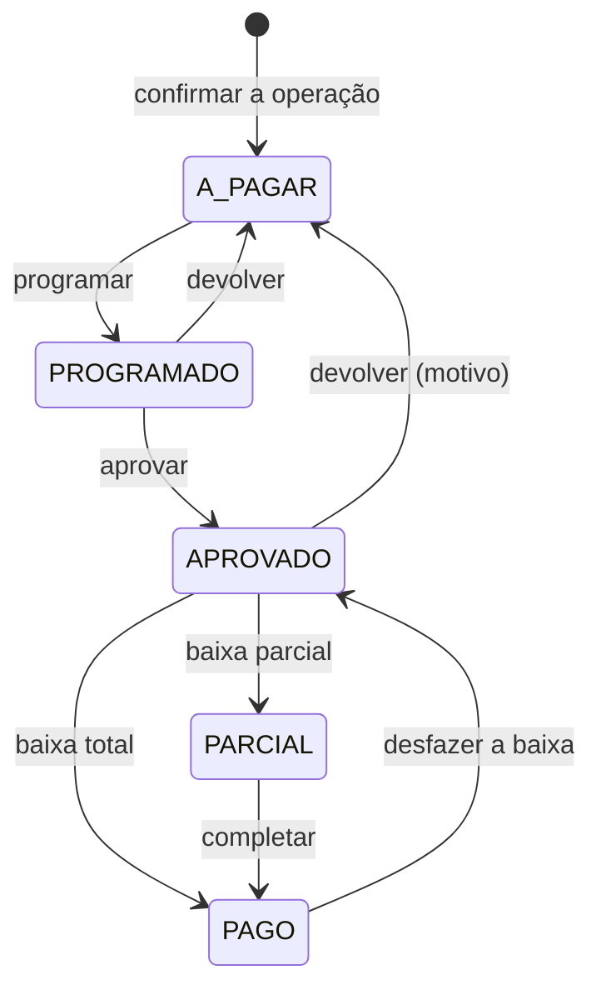

# Financeiro — títulos e baixas

> Fase 4. Aqui o sistema passa a tocar dinheiro que sai (e entra) de verdade. O cuidado contra duplicidade deixa de ser teórico.

## O que existe

| | |
|---|---|
| **Título** (`Invoice`) | Uma obrigação de **pagar** (compra, frete, comissão, impostos, avulso) ou um direito de **receber** (venda). Valor, vencimento, favorecido, conta bancária, operação de origem |
| **Baixa** (`Payment`) | O dinheiro que saiu ou entrou para quitar um título, no todo ou em parte. Documento (nº da TED, ID do Pix, nº do cheque) obrigatório |

Pago, falta e vencido **não são campos**: saem das baixas e do vencimento (regra 6), em `apps/finance/selectors.py`.

Dado bancário **nunca é digitado**: o título aponta para a `BankAccount` do favorecido. Na tela, o número inteiro só aparece para `FINANCEIRO`, `GESTOR` e `ADMIN`, e **cada consulta é auditada** (`VIEW`, um evento por pessoa, título e dia). No seletor de conta, só o final do número.

## Dois ciclos de vida

O título tem dois estados independentes, de propósito:

- **`status`** — o ciclo do registro (`CONFIRMADA` → `EXCLUIDA`, restaurável), igual ao de compra e venda. **Não existe `CANCELADO` à parte**: cancelar é excluir, com motivo ([06](06-edicao-exclusao-e-auditoria.md)).
- **`payment_status`** — o do dinheiro: `A_PAGAR → PROGRAMADO → APROVADO → PARCIAL → PAGO`.

**Título a receber** (de venda) não passa por programação nem aprovação: o recebimento é baixado direto de `A_PAGAR` (rótulo "A receber") para `PARCIAL`/`PAGO` ("Recebido"). Os códigos de estado são os do vocabulário; o rótulo muda com o sentido.

Desfazer a única baixa devolve o título ao estado que ele tinha antes (`APROVADO`, se havia aprovação). Aprovação e programação ficam guardadas enquanto a baixa existir.

## Geração a partir da operação (F4-02)

Confirmar **compra** gera um título a pagar por valor preenchido:

| Componente | Favorecido | Valor |
|---|---|---|
| `ANIMAIS` | o vendedor | `animal_value` |
| `FRETE`, `COMISSAO`, `IMPOSTOS` | **a definir** | `freight_value`, `commission_value`, `tax_value` |

Confirmar **venda** gera um título a receber (`VENDA`) do comprador. Vencimento = data da operação + `payment_days` (campo novo, opcional; vazio = vence na data). Ver [#16](99-pendencias.md#16--prazo-e-parcelamento-do-pagamento-fase-4) e [#17](99-pendencias.md#17--quem-recebe-o-frete-a-comissão-e-os-impostos-e-quem-aprova-e-paga-fase-4).

**Idempotente.** A chave é `(operação, componente)`, com `UNIQUE` no banco. Confirmar duas vezes, ou duas pessoas ao mesmo tempo, gera um título por componente — há teste de concorrência. A confirmação é uma transação: se o título falhar, a compra não confirma.

**O histórico não gera título.** O importador passa `gerar_titulos=False`: o que a planilha traz já foi pago fora do sistema, e títulos de 2025 apareceriam todos como vencidos. Para as compras e vendas já confirmadas, a tela **Operações sem título** (e o botão no detalhe da operação) gera sob demanda — decisão de quem conhece o caso. Ver [#18](99-pendencias.md).

### Corrigir, excluir e restaurar a operação

Os títulos são **efeitos** da compra/venda, como o movimento e os custos:

- **Corrigir a operação** atualiza os títulos que ela já tinha (e cria o que passou a existir, ex.: frete esquecido). Valor ou favorecido diferentes **anulam a programação e a aprovação** — elas valiam para os dados antigos. Se nada que importa mudou (uma observação), a aprovação continua.
- O **vencimento** acompanha a operação só quando a *data* dela muda; depois de gerado, o prazo se ajusta no próprio título e a correção da compra não o desfaz.
- **Excluir a operação** cancela os títulos na mesma cascata (mesma `cascade_root`). **Restaurar** traz de volta os que saíram *com ela* (`voided_with_origin`); título que alguém cancelou à mão continua cancelado.
- Compra do histórico (sem título) não ganha título por ter sido corrigida.

## Programar e aprovar (F4-03)

**Quem aprova não é quem executa.** Duas permissões distintas:

| Ação | Permissão | Papéis |
|---|---|---|
| Ver títulos | — | `ADMIN`, `GESTOR`, `FINANCEIRO`, `ESCRITORIO`, `CONSULTA` (só das fazendas do escopo) |
| Ver dado bancário | — | `ADMIN`, `GESTOR`, `FINANCEIRO` |
| Lançar, corrigir, programar | — | `ADMIN`, `GESTOR`, `FINANCEIRO`, `ESCRITORIO` |
| **Aprovar** | `finance.approve_payment` | `ADMIN`, `GESTOR`, `FINANCEIRO` |
| **Dar baixa** | `finance.execute_payment` | `ADMIN`, `FINANCEIRO` |
| **Desfazer baixa** | — | `ADMIN`, `FINANCEIRO` (com motivo) |
| Cancelar / restaurar título | — | `GESTOR`, `ADMIN` (com motivo) |

Além da permissão, o serviço recusa que **quem aprovou dê a baixa no mesmo título** quando há outro usuário ativo que possa fazê-lo (com acesso de escrita àquela fazenda): *"Quem aprova não é quem paga… Peça a outro usuário financeiro para dar a baixa (Maria)."* Se for o **único** usuário financeiro, a baixa passa — o sistema não tranca a operação — e fica na auditoria: *"Aprovação e baixa feitas pela mesma pessoa"*.

Pagar sem aprovação é recusado. Título sem favorecido não se programa. Tirar uma aprovação exige motivo e é de quem pode aprovar.

## Baixa idempotente (F4-04)

- Trava: `select_for_update` no título, antes de qualquer decisão.
- Chave `(título, documento)`, com `UNIQUE` parcial no banco (baixa desfeita sai da chave: dá para lançar de novo, certo).
- A soma das baixas **nunca passa do valor do título** — conferida sob a trava; vale também ao restaurar uma baixa.
- Data de pagamento não pode ser futura.
- O botão da tela se desliga ao enviar; a garantia real é a chave no servidor.

Provado por teste de concorrência: dois cliques simultâneos com o mesmo documento → uma baixa; duas baixas com documentos diferentes que somariam mais que o título → uma delas é recusada.

## Desfazer baixa e o que ela bloqueia (F4-05)

A **única exceção** ao "tudo é editável": desfazer no sistema **não desfaz a transferência no banco**. Por isso é de `FINANCEIRO`/`ADMIN`, com motivo, e a tela diz isso e manda conferir o extrato.

Enquanto a baixa existir, ela **bloqueia a montante** — e a mensagem diz o caminho, com link:

> Não é possível excluir agora: o lote LT-SFR-014 foi vendido na VD-2025/26-0004, e o pagamento dessa venda já foi baixado em 20/04/2026. Para prosseguir, desfaça antes a baixa do pagamento PG-2025/26-0009. **[Ir para o pagamento]**

Bloqueiam: excluir ou corrigir a **compra** (por baixa de título dela **ou da venda do lote que ela criou**), a **venda** e o **próprio título**. Desfazer ou restaurar baixa em **safra encerrada** também bloqueia (reabra a safra antes). Baixar em safra encerrada é permitido: caixa não é competência.

Mecanismo: `registro.bloqueios()` agora pode devolver `Bloqueio(texto, url, rotulo_url)` além de texto; a tela de impacto mostra o link.

## Contas, fluxo e mapa (F4-06 a F4-08)

- **Contas a pagar / a receber:** lista por vencimento; filtro por favorecido, situação e período do vencimento. No topo, o resumo sobre o que **falta** (valor − baixado): *vencidos · vencem hoje · próximos 7 dias (sem contar hoje) · depois · total em aberto*. O resumo não obedece aos filtros — é o retrato do que está aberto. Alerta de vencido no painel (e "pagamentos aguardando aprovação" para quem aprova).
- **Fluxo de caixa projetado** (substitui a `DASH CAIXA`): mês a mês da safra, **realizado separado do previsto**. Previsto = o que falta nos títulos em aberto, no mês do vencimento; realizado = baixas, no mês do pagamento. Vencido e não pago continua no mês em que venceu e é somado em nota. Sem saldo bancário no sistema, o acumulado parte de zero. "Antes/Depois da safra" só aparecem se houver movimento.
- **Mapa financeiro:** por favorecido, tipo e safra — total, pago, a pagar, vencido; mais os a receber por cliente.
- **Pagamentos realizados:** as baixas de um período.

Os cinco são relatórios do catálogo (tela, CSV, XLSX e PDF pelo mesmo `montar_relatorio`), restritos a quem vê títulos; a lista do índice também respeita o papel.

## Auditoria e linha do tempo

Toda transição grava `AuditEvent` (`UPDATE`, `APPROVE`, `CONFIRM` da baixa, `DELETE`/`RESTORE`) **na mesma transação** e um `OperationEvent` (a linha do tempo que o usuário lê no título). Consulta a dado bancário: `VIEW`. Nenhum dado bancário vai para a auditoria — só o fato da consulta.

## Testes que travam esta regra

`apps/finance/tests/`: geração idempotente (inclusive concorrente) · aprovação com permissão própria · quem aprova não paga · pagar sem aprovar recusado · baixa parcial até o total, nunca acima · clique duplo (serviço, tela e threads) · desfazer baixa com motivo · baixa bloqueia a compra, a venda e o lote com link · escopo (404) e papel (403) · CSRF · dado bancário mascarado e consulta auditada · fluxo, mapa e resumo de vencimentos.
