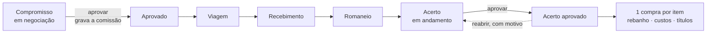

# Ciclo de compra

> Fase 5. É o ciclo do SisAtak — compromisso, viagem, recebimento, classificação de carcaça e acerto — encaixado sem alterar o núcleo. Desenho em [ADR 0008](../arquitetura/adr/0008-ciclo-de-compra-por-composicao.md). **Em 2026-10-03 o cliente respondeu 34 perguntas** que redefiniram partes deste ciclo — número único, vários compradores, sem rateio automático, títulos por viagem/comprador/tributo, encerramento manual: veja [12-decisoes-do-cliente-2026-10-03](12-decisoes-do-cliente-2026-10-03.md). A diretriz: o sistema **registra, controla e rastreia**; não deduz o que pode variar entre operações.

## O que existe

| | |
|---|---|
| **Compromisso** (`Commitment`) | O contrato, com o **número da operação** (`OP-000123`): produtor, fazenda de destino, **compradores**, programação (retirada, abate, caminhões, distância), **condição de pagamento** e **itens** — uma categoria cada, com preço por faixa de @ (1 a 5, digitado) ou por cabeça, e rendimento estimado de entrada |
| **Comissão** (`Commission`) | **Uma linha por comprador** (sem limite): tipo (percentual sobre o **valor bruto dos animais**, por cabeça ou valor direto), valor, extra e vencimento próprios. Sem valor informado, recebe o **snapshot** da regra vigente na aprovação |
| **Viagem** (`Trip`, `TripLoad`) | Um caminhão: transportador, motorista, veículo, placa, **número do ADF**, carga programada × embarcada, frete e **vencimento do frete** |
| **Recebimento** (`Receiving`, `ReceivingLine`) | A chegada de uma viagem: cabeças, peso, categoria, ocorrência e a **quebra de viagem digitada** |
| **Romaneio** (`GradingLine`) | Classificação × faixa × cabeças × peso de carcaça, por item |
| **Acerto** (`Settlement`, `SettlementLine`, `SettlementAllocation`, `FiscalNote`) | Previsto × realizado e o consolidado até o líquido; tributos, taxas e descontos **digitados** (alíquota, base, favorecido, vencimento só de registro); **distribuição por item informada** |
| **Cadastros** (`commercial`) | Classificação de carcaça, tipo de tributo/taxa/desconto (com o **efeito** escolhido pelo usuário), regra de comissão, **condições de pagamento** |

O núcleo (`Purchase`, `Lot`, `CostEntry`, `HerdMovement`) só ganhou campos de registro (condição de pagamento, rendimento de entrada); `Invoice` ganhou `origin_settlement` e `ref` para os títulos do acerto. A ligação do ciclo com a compra segue `CommitmentItem.purchase`.

## O fluxo



**A etapa não é campo.** "Em viagem", "recebido", "em acerto" saem do que existe (`selectors.etapa_do_compromisso`); excluir um recebimento faz a etapa recuar sozinha. Cada peça segue o ciclo padrão (editar com motivo, excluir com análise de impacto, restaurar) e tudo fica auditado.

**Depois do acerto aprovado** a situação também é derivada — dos títulos (`selectors.situacao_financeira`): *Aguardando financeiro* → *Pagamento programado* → *Pago*. O único passo **manual** é **Encerrada**: `ADMIN` e `GESTOR` encerram a operação (e a reabrem, com motivo); ficam status, data, responsável e observação, e a operação encerrada não recebe lançamento. O sistema nunca decide que a operação acabou só porque as contas foram pagas.

**Numeração.** O compromisso nasce com `OP-000123` (sequência global) e o número acompanha tudo: viagem `OP-000123/V1`, recebimento `/R1`, acerto `/AC1`, compra do item `/I1`; o financeiro e o centro de custo o carregam pela compra de origem. Operações anteriores mantêm o código antigo (`CM-…`).

## Preço, romaneio e valor dos animais

Cada item escolhe a base ([#26](99-pendencias.md#26--base-do-preço-do-item-ou-cabeça-fase-5)):

- **Por @ de carcaça:** valor = Σ do líquido do romaneio. Cada linha do romaneio é `peso ÷ 15 × preço da @ × (1 − desconto%)`, arredondada uma vez, na linha. O preço vem da faixa do contrato e é editável; **a faixa é escolhida pelo usuário** em cada linha ([#20](99-pendencias-resolvidas.md)).
- **Por cabeça:** valor = cabeças recebidas × preço por cabeça. Sem romaneio.

Média @, valor bruto, valor/kg e líquido **não são campos**: saem de `procurement/grading.py`.

## O acerto

`calcular_acerto()` devolve, sem gravar nada:

```
valor dos animais   = Σ itens − descontos
custo de aquisição  = animais + frete + tributos e taxas + comissão (todos os compradores, + extra)
líquido ao vendedor = animais − adiantamentos − créditos
```

**Tudo que varia é digitado.** Tributo, taxa, desconto, adiantamento e crédito (Funrural, Fundepec, GTA, ICMS, taxa de abate, indenização, Incentivo Precoce, Idaterra, crédito GR-3…) têm o **valor** informado pelo usuário, com **alíquota, base, favorecido, vencimento e documento** como campos auxiliares **só de registro** — o sistema não presume alíquota, base nem quem recebe. O efeito de cada tipo é escolhido **no tipo** (`TaxType.effect`); sem escolha, vale o padrão da natureza:

| Natureza (padrão) | Efeito |
|---|---|
| Tributo, taxa | soma ao custo de aquisição (`tax_value`) e gera título de impostos |
| Desconto | reduz o valor dos animais (custo **e** pagamento) |
| Adiantamento, crédito | reduzem só o líquido a pagar; o custo não muda |

**Comissão.** Uma por comprador. `PERCENTUAL` = valor bruto dos animais × percentual; `POR_CABECA`; ou `VALOR` informado direto ([#4](99-pendencias-resolvidas.md)). Calculada de `apps/commercial/commission.py`, isolada.

**Sem rateio automático** ([#22](99-pendencias-resolvidas.md)). Com **um** item recebido, ele fica com tudo. Com **mais de um**, o usuário informa quanto do frete, da comissão, dos tributos, dos descontos e dos adiantamentos é de cada item (`SettlementAllocation`) e **a soma tem de fechar com o total**: senão o acerto não é aprovado, e a pendência diz quanto falta (ou quanto passou). A tela de distribuição vem com uma *sugestão* (frete, comissão e tributos por cabeça; descontos e abatimentos por valor, sem centavo perdido) que só vale depois que o usuário confere e salva.

**Previsto × realizado:** cabeças, peso, categoria, valor, frete e data da retirada. Falta de dado é `—`, nunca `0`. O que impede aprovar vira **pendência com o motivo** (item por @ sem romaneio, nenhum animal recebido, distribuição que não fecha…); o que só merece atenção vira **aviso** (romaneio com outro número de cabeças, categoria diferente, frete sem o realizado).

## Aprovar o acerto

Uma transação, sob trava (`select_for_update`): para cada item **recebido**, cria e confirma uma `Purchase` pelo `confirmar_compra` de sempre — que dá a entrada no rebanho, lança os custos e gera o título dos animais — e depois gera os títulos do acerto.

- **Data da compra** = a do primeiro recebimento do item ([#24](99-pendencias-resolvidas.md)): o saldo histórico fica certo para trás. O animal só entra no saldo **na aprovação do acerto**; entre o recebimento e a aprovação o gado não está no saldo — o painel avisa.
- **Títulos** ([#17](99-pendencias-resolvidas.md), [#33](99-pendencias-resolvidas.md)): **animais** — um por item, ao vendedor, **pelo líquido** de adiantamentos e créditos (ou uma parcela por prazo, se a condição de pagamento é parcelada); **frete** — um **por viagem**, ao transportador dela, com o vencimento da viagem; **comissão** — um **por comprador**, com o vencimento dele; **tributos** — um **por linha**, ao favorecido que o usuário informou. Vencimento vazio = a data do acerto, independente do vencimento dos animais. O frete tem **centro de custo próprio** (`FRETE`).
- Aprovar duas vezes, ou duas pessoas ao mesmo tempo: **uma compra por item e um título por origem e componente** (chave `(origem, componente, ref)`, testado com threads).
- Aprovam `ADMIN` e `GESTOR`, **inclusive o próprio lançamento** ([#25](99-pendencias-resolvidas.md)): sem segregação, mas a auditoria guarda quem lançou, quem aprovou, data e hora.

## Trava de fechamento

Não é estado: é `bloqueios()`. Com o acerto aprovado, **tudo que alimenta o valor recusa edição** — itens, viagens, recebimentos, romaneio, linhas, comissão — e a mensagem diz o caminho: **reabrir o acerto**, com o link. A compra que nasceu do acerto também não se corrige direto.

**Reabrir** é formal: motivo obrigatório, quem e quando na auditoria, as compras saem em cascata (movimento, custos, títulos, lote), os títulos do acerto (frete, comissão, tributos) são cancelados na mesma cascata e o saldo volta ao que era **na data original** (compensação no razão). Bloqueiam, cada um com o caminho: **baixa de título** — inclusive nos de frete, comissão e tributo (link para o pagamento), **nota fiscal registrada** (retire-a antes, com motivo) e **safra encerrada**. O que depende das compras — saída de animais do lote, por exemplo — só é desfeito com a **cascata confirmada**.

Excluir e restaurar o acerto seguem a mesma mecânica; restaurar um acerto que nunca foi aprovado o devolve **em andamento**, sem aprovar.

## Contrato e relatórios

- **Contrato** (PDF) pelo `GeneratedDocument`, com `template_version` (`contrato-v2`), hash e quem gerou, todos os compradores e a condição de pagamento. **Banco, agência e conta do produtor** vão no contrato **só para quem já vê dado bancário** (`ADMIN`, `GESTOR`, `FINANCEIRO`) — e a geração com dado bancário fica na auditoria ([#27](99-pendencias-resolvidas.md)). A chave Pix nunca vai. Só por view autenticada.
- **Relatórios** (tela, CSV, XLSX e PDF; escopo de fazenda; negados ao `CAMPO`): programação de embarque e de abate, conferência do acerto (com banco, agência e conta para quem vê dado bancário), comissão por comprador (uma linha por comprador, a regra **gravada**), fretes e quebra, histórico por pecuarista e programado × realizado (com "Por que há —").

## Quebra de viagem

**Digitada** pelo usuário no recebimento (`Receiving.trip_loss_percent`). O sistema **não a calcula, não gera alerta percentual e não desconta nada** do valor dos animais ([#23](99-pendencias-resolvidas.md)); os pesos de origem e recebido aparecem lado a lado, como fato, e a quebra informada vai para os relatórios.

## Permissões

| | Papéis |
|---|---|
| Ver o ciclo | todos, **menos `CAMPO`** (preço, comissão e frete são dado comercial) |
| Lançar e corrigir | `ADMIN`, `GESTOR`, `ESCRITORIO` |
| Aprovar o compromisso, aprovar e reabrir o acerto, encerrar e reabrir a operação | `ADMIN`, `GESTOR` — o `ESCRITORIO` lança, não aprova; quem lançou pode aprovar o próprio lançamento |
| Excluir e restaurar | `ADMIN`, `GESTOR` (rascunho: quem lança) |
| Cadastros comerciais | `ADMIN`, `GESTOR` |

## Testes que travam esta regra

`apps/procurement/tests/` e `apps/commercial/tests/`: comissão bruta × líquida, por cabeça, vigência e arredondamento · **snapshot** (mudar a regra não muda o compromisso) · etapa derivada que recua · frete por critério com conta à mão · quebra digitada, sem alerta e sem desconto · romaneio do legado · naturezas das linhas · sugestão de distribuição sem centavo perdido · **distribuição informada que precisa fechar** · títulos por viagem, comprador e tributo · **aprovação concorrente** · tudo ou nada · trava de fechamento em cada peça · reabertura (saldo na data original, cascata, bloqueio por baixa e por nota) · escopo (404), papel (403) e CSRF · vários compradores · número único da operação · encerramento manual · contrato com dado bancário só para quem o vê · relatório com serviço trocado por falso.
