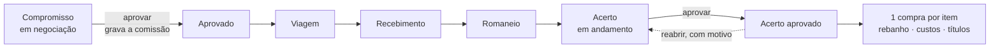

# Ciclo de compra

> Fase 5. Construída **antecipadamente**, sem demanda confirmada (decisão de Warley, 2026-10-02): é o ciclo do SisAtak — compromisso, viagem, recebimento, classificação de carcaça e acerto — encaixado sem alterar o núcleo. Desenho em [ADR 0008](../arquitetura/adr/0008-ciclo-de-compra-por-composicao.md); o que ficou em aberto, em [99-pendencias](99-pendencias.md) (#20 a #26 e #4, #8).

## O que existe

| | |
|---|---|
| **Compromisso** (`Commitment`) | O contrato: produtor, fazenda de destino, comprador, programação (retirada, abate, caminhões, distância, prazo) e **itens** — uma categoria cada, com preço por faixa de @ (1 a 5) ou por cabeça |
| **Comissão** (`Commission`) | **Snapshot** da regra aplicada, gravado quando o compromisso é aprovado |
| **Viagem** (`Trip`, `TripLoad`) | Um caminhão: transportador, motorista, placa, carga programada × embarcada, frete |
| **Recebimento** (`Receiving`, `ReceivingLine`) | A chegada de uma viagem: cabeças, peso, categoria, ocorrência |
| **Romaneio** (`GradingLine`) | Classificação × faixa × cabeças × peso de carcaça, por item |
| **Acerto** (`Settlement`, `SettlementLine`, `FiscalNote`) | Previsto × realizado e o consolidado até o líquido; tributos e notas **digitados** |
| **Cadastros** (`commercial`) | Classificação de carcaça, tipo de tributo/taxa/desconto, regra de comissão |

Nenhuma coluna de `Purchase`, `Lot`, `CostEntry`, `HerdMovement` ou `Invoice` foi acrescentada. A única ligação é `CommitmentItem.purchase`.

## O fluxo



**A etapa não é campo.** "Em viagem", "recebido", "em acerto" saem do que existe (`selectors.etapa_do_compromisso`); excluir um recebimento faz a etapa recuar sozinha. Cada peça segue o ciclo padrão (editar com motivo, excluir com análise de impacto, restaurar) e tudo fica auditado.

## Preço, romaneio e valor dos animais

Cada item escolhe a base ([#26](99-pendencias.md#26--base-do-preço-do-item-ou-cabeça-fase-5)):

- **Por @ de carcaça:** valor = Σ do líquido do romaneio. Cada linha do romaneio é `peso ÷ 15 × preço da @ × (1 − desconto%)`, arredondada uma vez, na linha. O preço vem da faixa do contrato e é editável; **a faixa é escolhida pelo usuário** em cada linha ([#20](99-pendencias.md)).
- **Por cabeça:** valor = cabeças recebidas × preço por cabeça. Sem romaneio.

Média @, valor bruto, valor/kg e líquido **não são campos**: saem de `procurement/grading.py`.

## O acerto

`calcular_acerto()` devolve, sem gravar nada:

```
valor dos animais   = Σ itens − descontos
custo de aquisição  = animais + frete + tributos e taxas + comissão (+ extra)
líquido ao vendedor = animais − adiantamentos − créditos
```

| Natureza da linha | Efeito ([#21](99-pendencias.md), hipótese) |
|---|---|
| Tributo, taxa | soma ao custo de aquisição (`tax_value`) e vira título de impostos, a definir |
| Desconto | reduz o valor dos animais (custo **e** pagamento) |
| Adiantamento, crédito | reduzem só o líquido a pagar; o custo não muda |

**Sem alíquota, sem fórmula, sem base de cálculo.** Tributo não foi confirmado com o contador: cada valor é digitado.

**Comissão.** `PERCENTUAL` sobre o **bruto** (valor dos animais) ou o **líquido** (bruto − frete − tributos), ou valor **por cabeça** — a base é escolhida na regra ([#4](99-pendencias.md)). Calculada de `apps/commercial/commission.py`, isolada.

**Previsto × realizado:** cabeças, peso, categoria, valor, frete e data da retirada. Falta de dado é `—`, nunca `0`. O que impede aprovar vira **pendência com o motivo** (item por @ sem romaneio, nenhum animal recebido…); o que só merece atenção vira **aviso** (romaneio com outro número de cabeças, categoria diferente, frete sem o realizado, quebra acima do limite).

## Aprovar o acerto

Uma transação, sob trava (`select_for_update`): para cada item **recebido**, cria e confirma uma `Purchase` pelo `confirmar_compra` de sempre — que dá a entrada no rebanho, lança os custos e gera os títulos.

- **Data da compra** = a do primeiro recebimento do item ([#24](99-pendencias.md)): o saldo histórico fica certo para trás. Entre o recebimento e a aprovação o gado **não está no saldo** — o painel avisa.
- **Rateio** do frete, da comissão e dos tributos entre os itens: por **cabeça recebida**; dos descontos, pelo **valor**; sem centavo perdido ([#22](99-pendencias.md)).
- **Títulos com favorecido:** frete ao transportador (se há um só), comissão ao comissionado; os animais, ao vendedor, **pelo líquido** de adiantamentos e créditos. Na compra direta isso continua "a definir", como na Fase 4.
- Aprovar duas vezes, ou duas pessoas ao mesmo tempo: **uma compra por item e um título por componente** (testado com threads).
- Aprovam `ADMIN` e `GESTOR` ([#25](99-pendencias.md)).

## Trava de fechamento

Não é estado: é `bloqueios()`. Com o acerto aprovado, **tudo que alimenta o valor recusa edição** — itens, viagens, recebimentos, romaneio, linhas, comissão — e a mensagem diz o caminho: **reabrir o acerto**, com o link. A compra que nasceu do acerto também não se corrige direto.

**Reabrir** é formal: motivo obrigatório, quem e quando na auditoria, as compras saem em cascata (movimento, custos, títulos, lote), e o saldo volta ao que era **na data original** (compensação no razão). Bloqueiam, cada um com o caminho: **baixa de título** (link para o pagamento), **nota fiscal registrada** (retire-a antes, com motivo) e **safra encerrada**. O que depende das compras — saída de animais do lote, por exemplo — só é desfeito com a **cascata confirmada**.

Excluir e restaurar o acerto seguem a mesma mecânica; restaurar um acerto que nunca foi aprovado o devolve **em andamento**, sem aprovar.

## Contrato e relatórios

- **Contrato** (PDF) pelo `GeneratedDocument`, com `template_version` (`contrato-v1`), hash e quem gerou. **Sem dado bancário.** Só por view autenticada.
- **Relatórios** (tela, CSV, XLSX e PDF; escopo de fazenda; negados ao `CAMPO`): programação de embarque e de abate, conferência do acerto, comissão por comprador (a regra **gravada**, não a do cadastro), fretes e quebra, histórico por pecuarista e programado × realizado (com "Por que há —").

## Quebra de viagem

`(peso de origem − peso recebido) ÷ peso de origem`, derivada; alerta acima de `QUEBRA_ALERTA_PERCENTUAL` (3%, palpite). **Não desconta nada** ([#23](99-pendencias.md)).

## Permissões

| | Papéis |
|---|---|
| Ver o ciclo | todos, **menos `CAMPO`** (preço, comissão e frete são dado comercial) |
| Lançar e corrigir | `ADMIN`, `GESTOR`, `ESCRITORIO` |
| Aprovar e reabrir o acerto | `ADMIN`, `GESTOR` |
| Excluir e restaurar | `ADMIN`, `GESTOR` (rascunho: quem lança) |
| Cadastros comerciais | `ADMIN`, `GESTOR` |

## Testes que travam esta regra

`apps/procurement/tests/` e `apps/commercial/tests/`: comissão bruta × líquida, por cabeça, vigência e arredondamento · **snapshot** (mudar a regra não muda o compromisso) · etapa derivada que recua · frete por critério com conta à mão · quebra e `None` sem peso · romaneio do legado · naturezas das linhas · rateio exato · **aprovação concorrente** · tudo ou nada · trava de fechamento em cada peça · reabertura (saldo na data original, cascata, bloqueio por baixa e por nota) · escopo (404), papel (403) e CSRF · contrato sem dado bancário · relatório com serviço trocado por falso.
